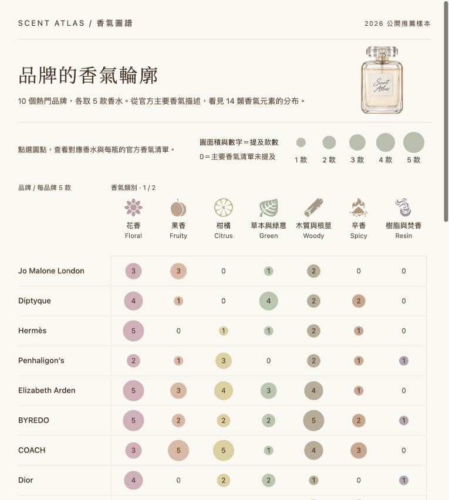

# 2026 香水香調資料視覺化

**課程：資料分析與視覺化應用｜作業：HW1**  
**學號：415085047｜姓名：嚴庭亞（YEN-TING-YA）**

## 線上展示

- [開啟香氣圖譜網頁][project-site]
- [GitHub 原始碼與說明文件][project-repository]

## 作業文件

- [四頁 Word 作業文件](docs/HW1-415085047-YEN-TING-YA.docx)
- [同內容的 Markdown 文件](docs/assignment-report.md)

文件包含專案截圖、GitHub 與網站連結、資料整理與 D3 設計、操作示範、圖表觀察及資料限制。

## 執行方式

本專案使用 HTML、CSS、JavaScript 與 D3.js 7.9.0，不需要安裝 npm 套件。

在專案根目錄執行：

```sh
python3 -m http.server 8767 --bind 127.0.0.1
```

使用瀏覽器開啟 <http://127.0.0.1:8767/prototype/>。此網址只供自己的電腦預覽。首次載入需要網路取得 D3.js 與字型；圖表資料、瓶身圖片與 SVG 圖示已內嵌於生成的 HTML。

操作方式：

1. 對照品牌列與香氣類別欄，閱讀圓面積和數字代表的提及款數（0–5）。
2. 點選非零圓點，查看該品牌符合類別的香水、瓶身圖與官方香氣描述。
3. 查看底線標示的計數依據；按「收起明細」或 Escape 返回圖表。
4. 展開頁尾「資料來源與採用說明」，查閱選樣文章、官方香氣資料、圖片和圖示來源。
5. 窄螢幕會自動將 14 類拆成數段，保留全部資料。



## 製作流程

1. 依 2026 公開推薦文章選取 10 個品牌、每品牌 5 款香水。
2. 整理官方具名香氣、原文、層次及來源，保留未公布資料的缺值。
3. 人工建立香氣詞彙對照與 14 類分析分組，同款香水在同類別去重計數。
4. 使用 Python 建置程式生成圖表資料與 HTML；以 D3 的 band scale 安排列欄、sqrt scale 讓圓面積對應款數。
5. 加入點擊明細、等高瓶身圖、分類 SVG 與折疊來源，並檢查桌機及窄螢幕。
6. 將頁面結構、樣式與 D3 程式拆成 HTML 模板、`style.css`、`chart.js`。

本專案使用 AI 協助資料整理、程式撰寫、裝飾瓶身生成與部分商品圖去背；資料出處、圖像處理方式及限制分別保存在來源紀錄與素材說明。

## 資料概要

本專案為「資料分析與視覺化應用」課程整理 **10 個品牌、每品牌 5 款，共 50 款香水**的香氣描述，研究快照日期為 **2026 年 10 月 3 日**。

50 款皆已保存相應版本的官方香氣資料與逐筆來源：**25 款有官方前中後調，25 款採未分層清單**。已建立 130 個香氣項目的中文工作譯名，保留 185 種原始寫法，共 297 組去重後的香水與香氣關係。來源共 62 筆：1 筆品牌依據、11 篇推薦文章、50 筆官方產品或系列頁。

這裡的「補齊」是完成所選官方區段的公開香氣整理，不代表取得完整配方，或所有品牌皆公布三層香調。

## 專案檔案

資料為 UTF-8 JSON。已建立 D3.js 點陣雛形，可點擊圓點查看香水明細，尚未整合 React.js。

### [docs/fragrance-notes.md]

- 內容：可直接閱讀的 50 款香氣總表、採用來源與差異註記

### [docs/sources.md]

- 內容：可放入作業的完整來源清單

### [data/perfumes.json]

- 內容：50 款樣本、濃度、香氣原文與譯名、層次、來源

### [data/note-vocabulary.json]

- 內容：香氣名稱、別名對照、專案分類規則

### [data/perfume-note-links.json]

- 內容：去重後的關係資料，方便 React 圖表讀取

### [data/sources.json]

- 內容：來源書目資訊、URL、查閱日期與採用區段

### [data/dataset.json]

- 內容：研究方法、完整度與限制

### [docs/data-quality.md]

- 內容：本次資料檢查結果

## 十個品牌的完成情況

官方整體香調標籤（例如 Floral、Woody）有 28 款，其餘 22 款標為採用區段未公布。50 款的香氣項目另有本專案分類，可比較花香、柑橘、木質等元素的提及情況。

### Jo Malone London

- 已有官方香氣資料：5
- 有前中後調：5
- 未完整分層：0

### Diptyque

- 已有官方香氣資料：5
- 有前中後調：0
- 未完整分層：5

### Hermès

- 已有官方香氣資料：5
- 有前中後調：0
- 未完整分層：5

### Penhaligon’s

- 已有官方香氣資料：5
- 有前中後調：0
- 未完整分層：5

### Elizabeth Arden

- 已有官方香氣資料：5
- 有前中後調：5
- 未完整分層：0

### BYREDO

- 已有官方香氣資料：5
- 有前中後調：5
- 未完整分層：0

### COACH

- 已有官方香氣資料：5
- 有前中後調：5
- 未完整分層：0

### Dior

- 已有官方香氣資料：5
- 有前中後調：0
- 未完整分層：5

### Aesop

- 已有官方香氣資料：5
- 有前中後調：5
- 未完整分層：0

### Le Labo

- 已有官方香氣資料：5
- 有前中後調：0
- 未完整分層：5

## 五十款樣本

以下是整理順序，沒有排名含義。濃度和香氣已逐款核對，詳見香氣總表。

### Jo Malone London

- 英國梨與小蒼蘭（English Pear & Freesia）
- 鼠尾草與海鹽（Wood Sage & Sea Salt）
- 罌粟花與大麥（Poppy & Barley）
- 英國梨與甜豌豆（English Pear & Sweet Pea）
- 英國橡樹與榛果（English Oak & Hazelnut）

推薦來源：[R01]

### Diptyque

- 爵夢（Orphéon）
- 肌膚之華（Fleur de Peau）
- 玫瑰之水（Eau Rose）
- 青蕨（Eau de Minthe）
- 睡蓮粼波（Lilyphéa）

推薦來源：[R02]

### Hermès

- 玫瑰花道（Rose Ikebana）
- 麝香鳶尾（Musc Pallida）
- 無酒精香氛水（Cabriole）
- 絲意薑香（Twilly d’Hermès Eau Ginger）
- 李先生的花園（Le Jardin de Monsieur Li）

推薦來源：[R03]

### Penhaligon’s

- 望眼欲穿的公爵夫人（The Coveted Duchess Rose）
- 喧囂紛擾的公爵（Much Ado About the Duke）
- 喬治勳爵的悲劇（The Tragedy of Lord George）
- 月亮女神（Luna）
- 廣霍之匣（Empressa）

推薦來源：[R04]

### Elizabeth Arden

- 綠茶（Green Tea）
- 向日葵（Sunflowers）
- 第五大道（5th Avenue）
- Arden Beauty
- Provocative Woman

推薦來源：[R05]

### BYREDO

- 無人之境（Rose of No Man’s Land）
- 返璞歸真（Blanche）
- 吉普賽之水（Gypsy Water）
- 莫哈維之影（Mojave Ghost）
- 熱帶爵士（Bal d’Afrique）

推薦來源：[R06]

### COACH

- 芙洛麗（Floral）
- Dreams Sunset
- 時尚經典男性（Coach for Men）
- 加州公路（Open Road）
- 逐夢（Dreams）

推薦來源：[R07]、[R08]

### Dior

- 花漾迪奧（Miss Dior Blooming Bouquet）
- 曠野之心（Sauvage）
- J’adore
- 蒙田大道（Gris Dior）
- 幸運時刻（Lucky）

推薦來源：[R09]

### Aesop

- 艾底希思（Eidesis）
- 蔚（Virere）
- 蒼穹之上・引（Above Us, Steorra）
- 詠（Aurner）
- 馥（Rōzu）

推薦來源：[R10]

### Le Labo

- ANOTHER 13
- SANTAL 33
- LYS 41
- THÉ MATCHA 26
- THÉ NOIR 29

推薦來源：[R11]

## 選樣方法

「2026」指推薦文章發布、更新或榜單製作年份，不代表香水上市年份、2026 年配方版本或完整年度銷售期間。品牌依據 [mybest 的十大香水品牌推薦]選取，款式依各品牌的 2026 推薦文章選樣。來源包含台灣、香港及海外媒體和零售商，屬目的性選樣，不能稱為可比的市場銷量排行榜。

每品牌五款。Le Labo 採 R11 推薦總表前五款；Elizabeth Arden 採 R05 文中前五款。COACH 採 R07 第 1、2、4、5 款，再由 R08 補入 Dreams EDP；R07 第 3 款的 EDT 標題與 EDP 商品連結互相矛盾，因此排除。

同款不同容量只計一款；EDT、EDP、Cologne、無酒精香氛水各自保留。香氣資料以相應版本的官方頁為準，不用 INCI 化學成分表推算香調。

## 香氣整理與計數方式

1. 優先使用官網明確的香氣表；沒有三層者使用具名香氣清單，不自行猜測層次。
2. 主表或主要描述標為 primary_notes；同頁額外具名香氣標為 additional_description，不強行歸入前中後調。
3. 每一項保留原文、中文工作譯名、層次及來源 ID。名稱歸併是分析上的處理，不表示原料化學性質完全相同。
4. 圖表出現次數定義為「有多少款香水的官方描述提到此香氣」。同款跨層出現兩次，只計一款。
5. note_ids 包含全部已採用具名香氣；只看主要清單時使用 primary_note_ids。頻率與關係圖須說明採用哪個範圍。
6. 名稱字典的 category_id 與 group_id 都是本專案人工整理，不能當成品牌官方整體香調分類。

例如 Eidesis 的雪松在中調、後調都出現，關係資料只建立一條 Eidesis—雪松連結，層次保留 middle、base。玫瑰、千葉玫瑰、大馬士革玫瑰可保留不同節點，也可依 group_id 合併；合併後仍應以每款去重。

## 欄位與缺值

- notes：各原始香氣詞的 note_id、raw_name、name_zh、stage、evidence_scope、source_id。
- note_pyramid：前中後調的 note_id 清單；null 搭配 not_disclosed_in_selected_source 表示採用來源未公布完整三層，不是尚未整理。
- fragrance_family：來源的整體香調原文、譯名與來源。未找到明確標籤時為 null，標示 not_disclosed_in_selected_section。
- notes_status：50 筆皆為 official_notes_collected，僅代表選定區段完成。
- concentration_status：全部核對官方商品名稱；Scent Spray 與無酒精香氛水不換算為 EDP。
- taiwan_availability_status：全部為 not_checked，不據此宣稱台灣現貨或持續販售。
- sources.retrieval_method：區分直接讀取頁面與官方頁搜尋擷取。後者可能反映搜尋引擎較早索引，查閱日期不等於內容更新日期。

## 來源差異與版本

- Hermès Musc Pallida：推薦文寫淡香水，採官方 EDP；Cabriole 保留無酒精香氛水。
- Arden Beauty、Provocative Woman、Sunflowers：同頁描述與香氣表不完全一致，採 Key Ingredients 的 Top/Middle/Base 表，差異留在逐款註記。
- Dior：採 Blooming Bouquet EDT、Sauvage EDT、J’adore EDP、Gris Dior EDP、Lucky EDP，排除其他版本比較文案。
- Penhaligon’s：採原版，未混入 Intense。Empressa 搜尋標題與正文濃度不一致，採正文 EDP；Lord George 依本次官網用詞保存 Rum。
- Aesop：Eidesis 與 Rōzu 採仍呈現原款的官方地區頁；Aurner 採 FR31，未混入 Entirely Aurner FR38。Above Us, Steorra 新舊官方頁三層一致，採可讀取的 FR34。
- Green Tea：保留官網 Scent Spray 商品名稱，不自行判定為 EDT 或 EDP。

## 作業可用的資料來源說明

> 本研究以 mybest 於 2026 年製作的香水品牌推薦名單選取十個品牌，再依據 2026 年發布或更新的媒體及零售商推薦文章，每品牌選取五款香水，共五十款。香氣描述依各款相應濃度或商品類型的品牌官方頁整理，查閱日期為 2026 年 10 月 3 日。二十五款保存官方公布的前、中、後調，另外二十五款使用未分層香氣清單。研究保留原始香氣名稱、採用區段與來源，另建立中文名稱對照與分析分類。香氣出現次數是所選樣本官方描述中的提及款數，不代表配方含量、實際香氣強度或市場銷量。

## 研究限制與後續

各品牌公開清單詳略不同，沒有提到某香氣不等於不含；共同提及某元素也不保證實際聞起來相似。官方文案與商品名稱可能更新，本資料不是歷史配方存檔。網站來自不同市場，尚未逐款確認台灣在售狀態。

下一步可使用這批資料製作香氣出現次數、品牌與香氣關係，或香水之間的描述相似度圖，再依課程規範撰寫分析。


## D3.js 點陣雛形

開啟 [prototype/index.html] 可查看品牌與香氣元素的點陣圖；首次載入需連線取得 D3.js 7.9.0 與字型。點擊非零圓點會展開對應香水，呈現官方香氣清單、已公布的前中後調、另列的補充描述及逐瓶官方來源，並標出計入該類的主要香氣。未公布層次者保留未分層清單。可用鍵盤 Enter 開啟，按收起明細或 Escape 返回原圓點。窄螢幕會拆成多段排列；這是固定樣本資料加上點擊查看明細的互動。

- 品牌依原資料順序排列，每品牌 5 款，不代表推薦次數或市場排名。
- 圓面積與數字表示官方主要清單提及該類元素的款數，使用 primary_note_ids，同款同類只計一次。
- 14 類是專案自訂的香氣元素分組，並非整瓶香水的香調家族。琥珀與麝香目前合併，不能用此欄計算白麝香的款數；此分組仍可調整。
- [prototype/brand-matrix-data.json] 保存 140 格計數及對應香水 ID，方便核對。
- 圖下「資料來源與採用說明」預設折疊，完整列出 62 筆來源的標題、發布者、作者（若有）、日期、網址、對應樣本與採用方式；官方資料另按品牌折疊。內容由 data/sources.json 與 data/perfumes.json 生成。
- 10 品牌、50 款皆加入瓶身圖片：點選圓點後，明細以左圖右文呈現；桌機瓶身顯示高度 120px，500px 以下為 88px，維持比例。圖片來源 IM01–IM50 另列、按品牌預設折疊，不混入原本 62 筆研究來源。Jo Malone、Penhaligon’s、Aesop 共 15 張沿用官方透明圖片，其他 35 張以內建 ImageGen 對官方原圖去背；AI 可能改動細小文字或反光，外觀細節以原圖為準。逐款原圖網址、商品頁、香氣來源編號、查閱日期及處理方式保存在 `prototype/assets/perfumes/manifest.json`；原檔、AI 輸出與提示詞亦分開保存。
- 圖片展示版本為透明 WebP，建置時連同資料內嵌進 HTML，不依賴商品站外連圖片。`scripts/prepare-perfume-images.py` 僅縮小既有透明圖並計算 CSS 顯示邊界，不執行 AI 或去背；需 Pillow 與 NumPy。一般重新建置只需 `python3 scripts/build-prototype.py`，使用標準函式庫即可。
- 香氣類別上方加入 14 枚 Game Icons SVG，取自 `react-icons/gi` 5.5.0，由 D3 繪製。花香用 `GiFlowerEmblem`、果香用 `GiPeach`、柑橘用 `GiOrange`、草本用 `GiLindenLeaf`、皮革用 `GiAnimalHide`，其他分類對照見 `prototype/assets/category-icons/manifest.json`。圖示維持等大、沿用分類色並略為加深；只有圖表圓點面積表示數量。琥珀與麝香的棉花為柔軟意象，不是香料資料。SVG、作者 Lorc / Delapouite、原始網址及 CC BY 3.0 授權一併保存，並列於網頁折疊來源區；建置時嵌入 HTML，無須額外載入 React 或圖示 CDN。
- 文字採深棕色 #4b3428，次要文字為 #654b3d；圓點維持原本柔和的分類配色。
- 標題右側加入淡香檳色香水瓶，使用透明切角瓶蓋與草寫 Scent Atlas 標籤，手機版縮小並與標題並排。圖片為純裝飾，對讀屏隱藏，不影響圖表計數；透明背景素材保存在 `prototype/assets/perfume-bottle-glass-cap-pale.png`，建置時內嵌以方便移動頁面。
- 原始碼已分開：`prototype/brand-matrix.template.html` 負責 HTML 結構，`prototype/style.css` 負責配色與排版，`prototype/chart.js` 負責 D3 繪圖、資料來源呈現與點擊明細。D3 套件由 CDN 載入，自訂圖表程式透過 `<script src="./chart.js">` 引用。
- `prototype/index.html` 是建置後的瀏覽入口；`prototype/brand-matrix.html` 是對應的 HTML 片段。修改 HTML 模板或資料後，在專案根目錄執行 `python3 scripts/build-prototype.py`。修改 CSS / JS 後重新整理頁面即可；分享或繳交時保留 HTML、`style.css` 與 `chart.js` 的相對位置。
- 資料、圖片及圖示路徑仍由建置程式嵌入 HTML，無須另外 fetch 資料檔。`--output` 會連同 CSS / JS 複製到指定資料夾；`--inline` 可另外產生內嵌 CSS / JS 的預覽片段。

香調分類參考：[Fragrance Foundation France 的七大家族]、[Michael Edwards 香調輪]。兩者是不同分類系統，不能與本專案 14 類元素直接對應。[Jo Malone 官方英國梨系列]把英國梨與甜豌豆歸為淡花香，同時列出白麝香，說明具名香氣與整體香調不是一對一關係。以上查閱日期為 2026 年 10 月 3 日。

<!-- 參考式連結：網址集中於此，供上方的連結標籤引用。 -->
[docs/fragrance-notes.md]: docs/fragrance-notes.md
[docs/sources.md]: docs/sources.md
[data/perfumes.json]: data/perfumes.json
[data/note-vocabulary.json]: data/note-vocabulary.json
[data/perfume-note-links.json]: data/perfume-note-links.json
[data/sources.json]: data/sources.json
[data/dataset.json]: data/dataset.json
[docs/data-quality.md]: docs/data-quality.md
[R01]: docs/sources.md#r01
[R02]: docs/sources.md#r02
[R03]: docs/sources.md#r03
[R04]: docs/sources.md#r04
[R05]: docs/sources.md#r05
[R06]: docs/sources.md#r06
[R07]: docs/sources.md#r07
[R08]: docs/sources.md#r08
[R09]: docs/sources.md#r09
[R10]: docs/sources.md#r10
[R11]: docs/sources.md#r11
[mybest 的十大香水品牌推薦]: https://tw.my-best.com/117104
[prototype/index.html]: prototype/index.html
[prototype/brand-matrix-data.json]: prototype/brand-matrix-data.json
[Fragrance Foundation France 的七大家族]: https://www.fragrancefoundation.fr/education/les-7-familles-de-parfum/
[Michael Edwards 香調輪]: https://www.fragrancesoftheworld.com/fragrancewheel/
[Jo Malone 官方英國梨系列]: https://www.jomalone.com/english-pear-collection

[project-site]: https://victorien1963.github.io/1151VIS-HW1-415085047-YEN-TING-YA/
[project-repository]: https://github.com/victorien1963/1151VIS-HW1-415085047-YEN-TING-YA
