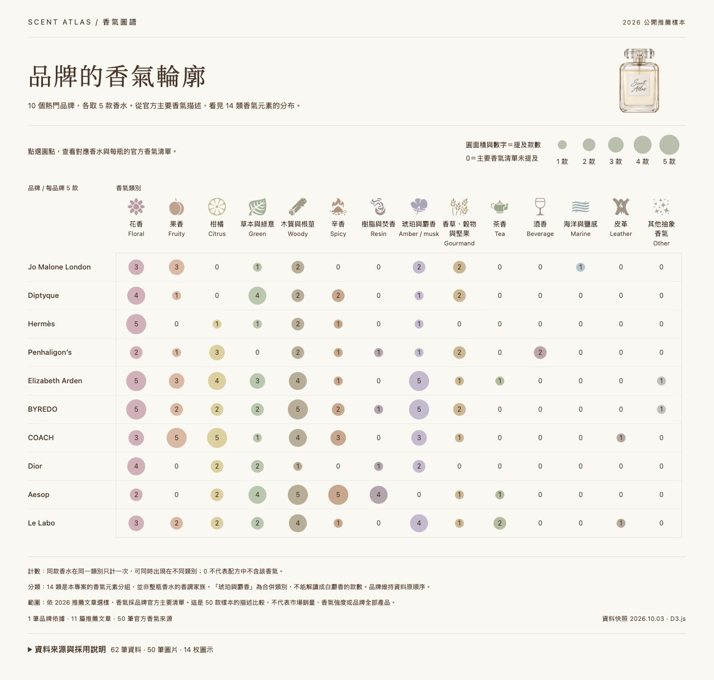
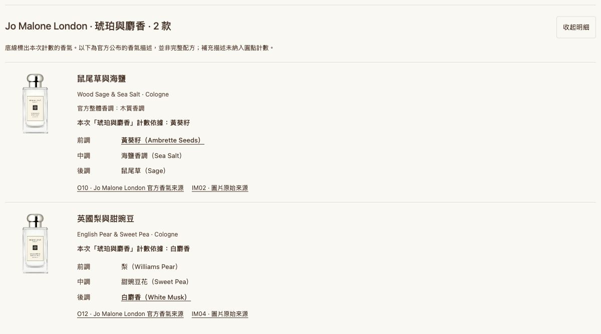

# 香氣圖譜

品牌香氣元素視覺化

資料分析與視覺化應用 HW1　｜　415085047 嚴庭亞

製作日期 2026 年 10 月 4 日　｜　資料快照 2026 年 10 月 3 日

[GitHub 專案](https://github.com/victorien1963/1151VIS-HW1-415085047-YEN-TING-YA)

[線上展示](https://victorien1963.github.io/1151VIS-HW1-415085047-YEN-TING-YA/)

我想比較不同品牌推薦香水的香氣元素，因此整理 10 個品牌、每品牌 5 款，共 50 款香水的官方描述，以 D3.js 製作品牌與香氣類別的點陣圖。讀者可以先比較分布，再點開圓點查看對應香水與香氣來源。



圖 1　品牌與香氣類別點陣圖的實際執行畫面

圖中每列是一個品牌，每欄是一種香氣元素分組；圓面積與數字表示五款樣本中的提及款數，範圍為 0 至 5。顏色和圖示協助辨認類別，品牌維持原資料順序。

## 資料整理與製作過程

### 選取有來源可追溯的樣本

先依 mybest 的 2026 品牌推薦文章選取 10 個品牌，再從 11 篇媒體與零售商推薦文章中各取 5 款。2026 指文章發布、更新或榜單製作年份；這批樣本不代表完整年度銷量排行。每筆資料保留品牌、名稱、濃度或商品類型及來源編號。

部分文章需要額外核對版本。例如 COACH 的一筆 EDT 標題與 EDP 商品連結不一致，因此排除，改由另一篇文章補入 Dreams EDP；Musc Pallida 則依官方頁採 EDP。相同香水的不同容量不重複計數。

### 整理官方香氣並保留缺值

香氣依相應版本的官方商品或系列頁整理，共保存 50 筆官方來源。25 款公布完整前中後調，另 25 款保留未分層清單，不自行推測層次。每個香氣項目保存原文、中文工作譯名、層次與來源，並區分主要清單和補充描述。

### 轉成可比較的計數資料

將香氣項目對應到 14 類專案分組，例如花香、果香、木質與根莖、琥珀與麝香。這些分組用來比較香氣元素，與整瓶香水的官方香調家族分開保存。圖表只採 primary_note_ids，同款香水在同一類別最多計一次。

例如 Eidesis 的雪松在中調和後調都出現，仍只算一款；若同一瓶同時提到兩種花香，也只在花香欄加一。同一瓶可以出現在不同類別，因此各欄合計不必等於 50。

### 從資料生成網站

1. 將樣本、香氣字典、關係資料與來源記錄分別保存成 UTF-8 JSON。

2. 使用 scripts/build-prototype.py 依品牌彙整計數及對應香水 ID，生成 10 × 14 共 140 格資料。

3. HTML 模板負責頁面結構，style.css 負責樣式，chart.js 負責 D3 繪圖、來源呈現與明細互動。

4. 建置時把資料、透明瓶身圖和 SVG 路徑嵌入 HTML，發布至 GitHub Pages；D3 7.9.0 與字型於載入時取得。

目前共有 62 筆研究來源：1 筆品牌依據、11 篇推薦文章、50 筆官方來源。圖片與圖示另列來源，不混入這 62 筆。

## D3 設計與操作示範

### 位置和面積如何表示資料

使用 d3.scaleBand() 安排品牌列與類別欄，透過資料綁定生成 SVG 圓點與數字。半徑採平方根比例尺，讓圓面積與款數成正比；若直接把半徑設為款數，較大數值會被視覺放大。

```js
const radius = d3.scaleSqrt()
  .domain([0, data.perBrand])
  .range([0, 18]);
```

數值為 0 時只顯示數字。14 枚 SVG 圖示保持相同尺寸，只有圓點面積表示數量。文字使用深棕色，分類使用柔和配色；ResizeObserver 會依畫面寬度重新分段排列，保留全部 140 格。

### 點開圓點查看香水

1. 開啟線上展示，點選 Jo Malone London 的「琥珀與麝香」圓點。

2. 查看兩款香水的瓶身圖、濃度與香氣清單；底線標出本次計數依據。



圖 2　琥珀與麝香類別的香水明細及計數依據

此例的兩款分別因黃葵籽與白麝香被分入同類，不能把「2 款」直接解讀成兩款都有白麝香。點擊明細中的官方來源可回到原始資料。

3. 按「收起明細」返回圖表；頁尾「資料來源與採用說明」可展開查閱，官方資料再依品牌折疊。

## 圖表觀察與資料限制

### 從這批樣本可看出的差異

50 款樣本中，主要清單提及花香的有 36 款，提及木質與根莖的有 31 款；兩類可以出現在同一瓶香水，因此不能相加當作不同香水的總數。

Aesop 的五款樣本都提及木質與根莖、辛香，其中四款提及樹脂與焚香；COACH 的五款則都提及果香與柑橘。這些差異讓品牌樣本的描述重點更容易比較，但不足以代表品牌全部產品。

Le Labo 有兩款提及茶香，Aesop 與 Elizabeth Arden 各一款。讀者可以由這類較少出現的元素縮小範圍，再透過明細理解每一瓶的具名香氣。上述數字由專案的品牌計數 JSON 彙整。

### 解讀時需要保留的限制

- 樣本來自推薦文章，屬目的性選樣，不能推論市場銷量、品牌人氣排名或台灣在售狀態。

- 官方香氣文案不等於完整配方或成分比例；清單長短不同，0 代表採用清單未提及，不代表不含。

- 14 類為人工分析分組；共同提及某類元素，不保證兩瓶實際聞起來相似。琥珀與麝香也不能直接當成白麝香統計。

- 這是固定資料快照加上點擊明細的互動，並非即時更新資料。部分官方內容來自搜尋擷取，可能反映較早索引。

### 資料來源與素材說明

完整來源清單保留標題、發布者、作者、日期、URL、查閱方式與採用區段。香氣資料查閱日為 2026 年 10 月 3 日；商品圖片與圖示紀錄為 10 月 4 日。

[B01　張伯萱，mybest，2026 年 3 月 17 日。10 大香水品牌推薦排行榜【2026最新】。](https://tw.my-best.com/117104)

[O12　Jo Malone London，無日期。English Pear & Sweet Pea Cologne。圖 2 白麝香的官方來源。](https://www.jomalone.co.uk/product/25946/118129/colognes/english-pear-sweet-pea-cologne)

[完整 62 筆研究來源與採用說明](https://github.com/victorien1963/1151VIS-HW1-415085047-YEN-TING-YA/blob/main/docs/sources.md)

[50 款香氣清單及版本差異](https://github.com/victorien1963/1151VIS-HW1-415085047-YEN-TING-YA/blob/main/docs/fragrance-notes.md)

瓶身圖片共 50 張，15 張沿用官方透明圖，35 張經 AI 去背；細節以官方原圖為準。圖示來自 React Icons 的 Game Icons，作者 Lorc、Delapouite，採 CC BY 3.0。裝飾香水瓶為 AI 生成。本專案另使用 AI 協助資料整理與程式撰寫，來源與處理紀錄保留於專案。
